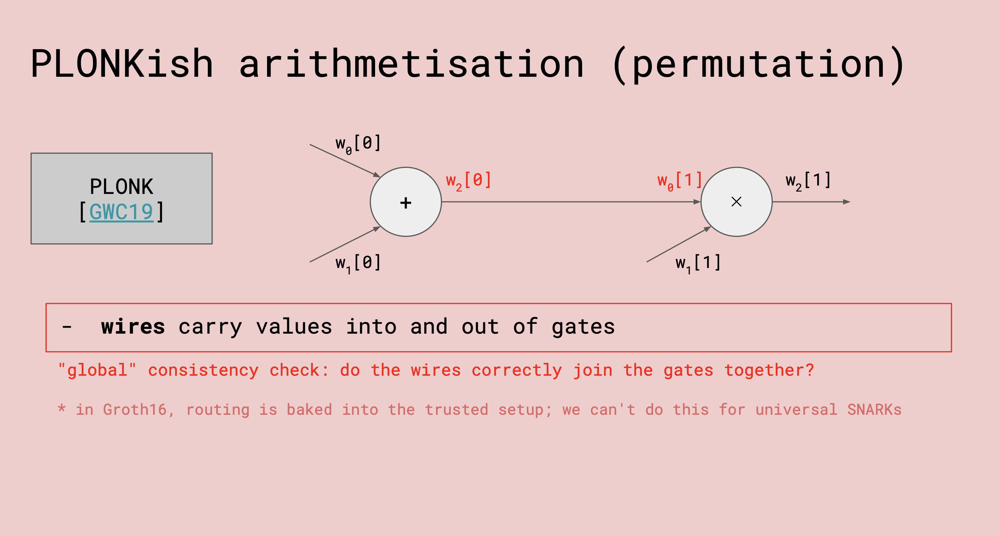

# Intro to PLONKish/halo2
## Custom Gate
自定义门相比vanilla的Plonk门引入了Verifier的挑战参数 $y$ ，使得要满足的任意线性组合是相互独立的，例如：

$$
q_{add} \cdot (a_0 + a_1 - a_2) + y \cdot q_{mul} \cdot (a_0 \cdot a_1 - a_2) + y^2 \cdot q_{bool} \cdot (a_0 \cdot a_0 - a_0) = 0.
$$

## Permutation

从全局的角度来看，需要加法门的输出 $w_2[0]$ 与 乘法门的输入 $w_0[1]$ 相等。在Groth16中，这步是写进 trusted setup中的，但是在 universal SNARKs中不能这样做。

这个就是拷贝约束，用置换证明来实现。

## layouter
* 为什么需要用layouter来进行优化？
    * 更多的行意味着在做FFT时的速度更慢，因此需要尽量减少电路的行数。
    * 电路中的每一列都需要进行承诺，因此列的数量会影响证明的大小。

## IPA
* zkevm的多项式承诺不像Halo2用的是内积证明，而是KZG。

## accumulation
accumulation scheme
根据内积证明的参数，来构造累加方案。累加方案的思想是分割成一些简单的累加步和一个比较expensive的decider。